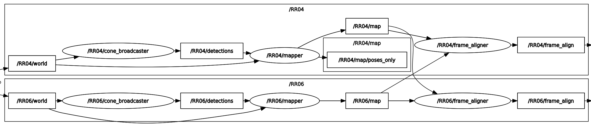

# motlee_ros

ROS package for running MOTLEE frame alignment

# Install

Prereqs: [MOTLEE](https://gitlab.com/mit-acl/dmot/motlee) and [CLIPPER](https://github.com/mit-acl/clipper)

# Node Architecture

Example node architecture:

Put mapper and frame_aligner within robot's namespace and give the frame_aligner node a list of neighboring robots. See two robot [example launch file](./motlee_ros/launch/two_robot_example.launch).

mapper node listens for detections (in its body frame) and poses and outputs a map in the world frame. 

frame_aligner node listens to all the different maps and publishes frame_align messages containing relative transformations between robot frames at a selected frequency.